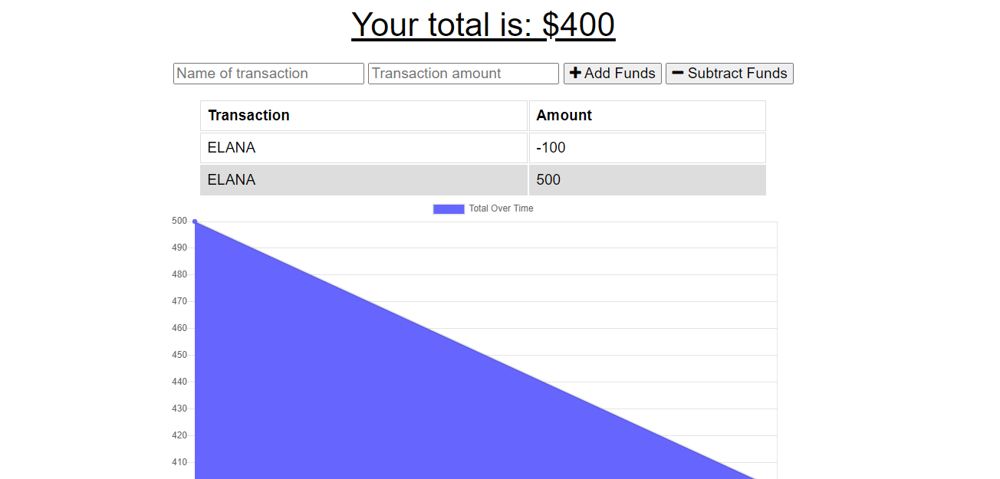

# Unit 18 PWA Homework: Online/Offline Budget_Trackers

  

  
 ## Table of Contents
  
* [Description](#Description)
  
* [Installation](#Installation)
  
* [Usage](#Usage)
  
* [License](#License)
  
* [Contributors](#Contributors)
  
* [Questions](#Questions)
  
 ## Description 
  
For this project I added functionality to our existing Budget Tracker application to allow for offline access and functionality.

With this application an avid traveller is able to track their withdrawals and deposits with or without a data/internet connection. Giving them a fast and easy way to track their money and account balance accurately when traveling is critical.Therefore, having offline functionality is paramount to this applications success.

PHOTO OF MY ASSIGNMENT:

 

[link to my project](https://budgettrackerrh.herokuapp.com/)

 ## Installation
  
 💾 
 RUN:
  
* npm i
* npm start
* heroku open

    
 ## Usage
 

 This  Online/Offline Budget Tracker application allows users to:

  Offline Functionality:

  * Enter deposits offline

  * Enter expenses offline

When brought back online:

  * Offline entries should be added to tracker.

 
LANGUAGES USED ARE:
 
FRONT END:

- HTML
- CSS
- JAVASCRIPT

BACKEND:
- JAVASCRIPT
- HEROKU
- NODE.JS
- MONGODB

 ## License
 To view the license click [here](https://choosealicense.com/licenses/mit/)

  
 ## Contributors
  
 Contributions are accepted. Feel free to fork.
1. Fork it
2. Create your feature branch (git checkout -b feature/fooBar)
3. Commit your changes (git commit -am 'Add some fooBar').
4. Push to the branch (git push origin feature/fooBar)
5. Create a new Pull Request# RfHogans

  
  
 ## Questions
  
 If you want have any additional questions, you can reach me at
  
 **Github**: https://github.com/rabiahfh
  
 **Email**: hogansrabiah@gmail.com

``